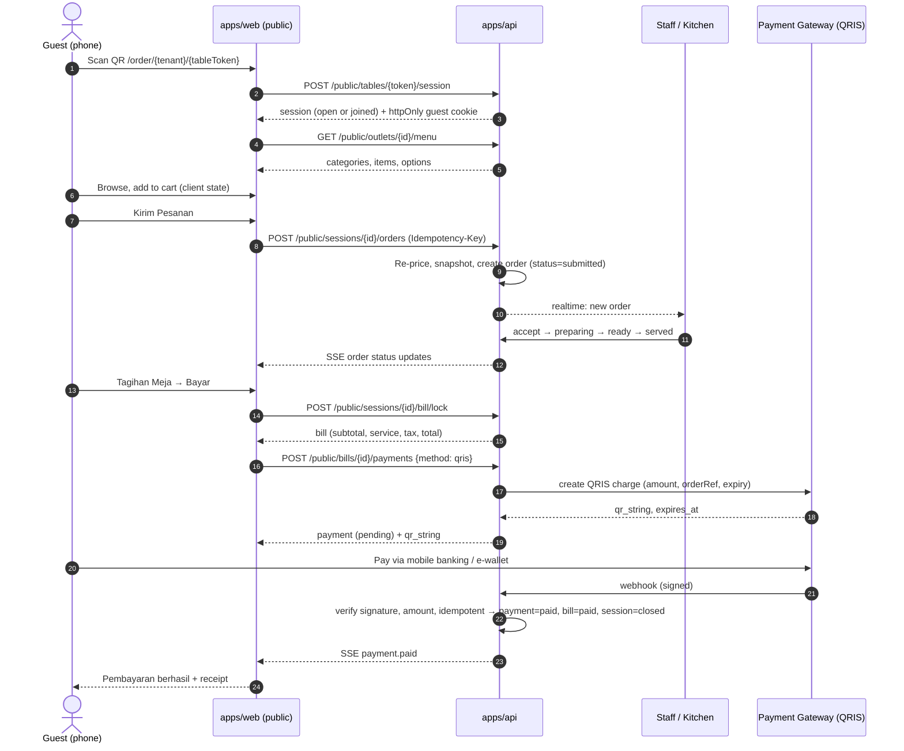

# Public Table Ordering — End-to-End PR Flow

> From zero to "guest scans QR → orders → kitchen serves → guest pays at the table".
> Stack: `apps/api` (Express + TypeScript + Drizzle + PostgreSQL), `apps/web` (Next.js 16 App Router + React 19 + Tailwind + shadcn/ui + TanStack Query + Axios + Sonner).
> Companion doc: `public-table-menu-design-reference.md` (UI tokens and components).

---

## 0. The whole flow at a glance



Alternative payment path: **Bayar di Kasir** — guest requests bill, staff collects cash/EDC and marks the bill paid from the admin panel. Same bill and session state transitions.

---

## 1. Core decisions (lock these before PR 1)

| Topic | Decision |
|---|---|
| Table identity | Each table has a long random `qr_token` (not the table id). Rotating the token invalidates old printed QR codes. |
| Session | One **open** `table_session` per table at a time. First scan opens it; later scans (other guests at same table) **join** it. Closed only by payment or by staff. |
| Guest identity | No login. API issues an httpOnly signed cookie `guest_sid` (per device) bound to the session. Staff can kick/close. |
| Cart | Client-side only (per device, `sessionStorage` keyed by table token). Not shared between devices at the same table. Server knows nothing until submit. |
| Order | Each "Kirim Pesanan" = one `order` (a round). A session has many orders. |
| Pricing | Server always re-prices from the catalog; client totals are display-only. Order items store **snapshots** (name, unit price, option names/prices) so later menu edits don't change history. |
| Money | Integer rupiah (`bigint`/`integer`), never floats. |
| Charges | Per-outlet config: `service_charge_bps` (e.g. 500 = 5%), `tax_bps` (e.g. 1000 = 10% PB1/PBJT), `tax_base` = `subtotal` or `subtotal_plus_service`, `rounding` = none / nearest 100 / nearest 500 / nearest 1000. |
| Bill | Aggregates all non-cancelled orders of the session. Becomes **locked** when payment starts; ordering is blocked while a bill is locked. Unlock if payment expires/fails. |
| Payment | Provider adapter interface (Xendit / Midtrans / other). v1 methods: `qris` (dynamic) and `cashier`. Paid status comes **only** from a verified webhook or staff action, never from the client redirect. |
| Realtime | SSE (`GET /public/sessions/{id}/events`) for guests; staff side reuses the same event bus. Polling fallback every 5–10s. |
| Idempotency | `Idempotency-Key` header required on order submit and payment create; stored with the response for 24h. |
| Split bill | Out of scope for v1. Data model leaves room (`payments` is 1-to-many with `bills`). |

---

## 2. State machines

**table_session**
```
open ──(bill locked)──▶ billing ──(paid)──▶ closed
  ▲                        │
  └──(payment expired/failed/cancelled)
open ──(staff close / void)──▶ closed
```

**order**
```
submitted ─▶ accepted ─▶ preparing ─▶ ready ─▶ served
    │            │
    └─▶ rejected └─▶ cancelled   (staff only; reason required)
```
Guest can cancel only while `submitted`.

**bill**
```
open ─▶ locked ─▶ paid
          │
          └─▶ open   (payment expired/failed/cancelled)
```

**payment**
```
pending ─▶ paid
   ├──▶ expired
   ├──▶ failed
   └──▶ cancelled
paid ─▶ refunded (staff, later)
```

Enforce transitions in one place per entity (`assertTransition(from, to)`), inside a DB transaction with `SELECT … FOR UPDATE` on the row.

---

## 3. Data model (Drizzle)

```
outlets              id, tenant_id, slug, name, tagline, logo_url, verified,
                     is_open, service_charge_bps, tax_bps, tax_base, rounding,
                     payment_methods (jsonb), timezone
tables               id, outlet_id, label ("Meja 12"), code, qr_token (unique),
                     is_active
table_sessions       id, outlet_id, table_id, status, opened_at, closed_at,
                     closed_by, closed_reason
  unique partial index: (table_id) WHERE status IN ('open','billing')
guest_devices        id, session_id, device_sid_hash, display_name, created_at, revoked_at

menu_categories      id, outlet_id, name, icon, sort_order, is_active
menu_items           id, outlet_id, category_id, name, description, price,
                     image_url, badges (text[]), is_popular, is_available, sort_order
option_groups        id, item_id, name, required, min, max, sort_order
options              id, group_id, name, price_delta, is_available, sort_order

orders               id, session_id, outlet_id, table_id, device_id, number
                     (per-outlet daily sequence), status, note, subtotal,
                     idempotency_key, submitted_at, updated_at
order_items          id, order_id, item_id, name_snapshot, unit_price_snapshot,
                     qty, note, line_total, status
order_item_options   id, order_item_id, option_id, name_snapshot, price_delta_snapshot

bills                id, session_id (unique), status, subtotal, service_charge,
                     tax, rounding_adjustment, total, locked_at, paid_at
payments             id, bill_id, method, provider, provider_ref, amount, status,
                     qr_string, expires_at, paid_at, raw_last_event (jsonb)
payment_events       id, payment_id, provider_event_id (unique), type, payload, received_at
service_requests     id, session_id, type (call_waiter|water|cutlery|bill), status,
                     created_at, handled_by, handled_at
idempotency_keys     key, scope, request_hash, response (jsonb), created_at
```

---

## 4. API contract (public)

| Method | Path | Notes |
|---|---|---|
| POST | `/public/tables/:qrToken/session` | Open or join session; sets `guest_sid` cookie. Returns outlet, table, session. 404 if token invalid/inactive. |
| GET | `/public/outlets/:outletId/menu` | Categories + items + options. Cacheable (ETag, 30–60s). |
| GET | `/public/sessions/:id` | Session + orders summary (auth: guest cookie). |
| POST | `/public/sessions/:id/orders` | Body: `{ lines:[{itemId, qty, optionIds[], note}], note }`. Idempotency-Key required. 409 if session not `open`. 422 with details if item unavailable/price changed. |
| POST | `/public/orders/:id/cancel` | Only while `submitted`. |
| GET | `/public/sessions/:id/bill` | Live-computed preview. |
| POST | `/public/sessions/:id/bill/lock` | Freezes totals, session → `billing`. |
| POST | `/public/bills/:id/payments` | `{ method: "qris" \| "cashier" }`. Idempotency-Key required. |
| GET | `/public/payments/:id` | Status polling fallback. |
| POST | `/public/sessions/:id/service-requests` | `{ type }`, rate limited (1/type/60s). |
| GET | `/public/sessions/:id/events` | SSE: `order.updated`, `bill.updated`, `payment.updated`, `session.closed`. |
| POST | `/webhooks/payments/:provider` | Signature verified, raw body, idempotent by event id. |

Staff (authenticated, RBAC) endpoints come in the staff PRs below.

---

## 5. PR plan

Each PR is small enough to review in one sitting, ships behind a feature flag (`PUBLIC_ORDERING_ENABLED`) until PR 17, and has explicit acceptance criteria.

### Phase A — Foundations

**PR 1 — DB: outlets, tables, QR tokens, sessions**
- Drizzle schema + migrations: `outlets` (incl. charge config), `tables`, `table_sessions`, `guest_devices`.
- Partial unique index for one open session per table.
- Seed: 1 outlet, 10 tables with tokens.
- Util `generateQrToken()` (≥ 128-bit, base64url).
- ✅ Migration runs up/down; seed creates data; unique index rejects a second open session.

**PR 2 — DB + API: menu catalog (read)**
- Schema: `menu_categories`, `menu_items`, `option_groups`, `options`.
- `GET /public/outlets/:id/menu` with Zod response schema shared via `packages/shared` (or `apps/api/src/contracts`).
- Virtual "Populer" category derived from `is_popular`.
- ✅ Returns only active categories/items, sorted; unavailable items included with `isAvailable=false`; ETag works.

**PR 3 — API: table session open/join + guest cookie**
- `POST /public/tables/:qrToken/session`: in a transaction, find open session or create one; register device; set signed httpOnly `guest_sid` cookie (SameSite=Lax, Secure).
- Middleware `requireGuestSession(sessionId)`.
- Rate limit by IP + token.
- ✅ Two devices scanning the same table land in the same session; inactive table → 404; closed session → new one opens on next scan.

**PR 4 — Web: public route group + theme + shell**
- `app/(public)/order/[tenantSlug]/[tableToken]/layout.tsx`: Plus Jakarta Sans, `.public-menu` token scope, light-only, `lang="id"`, safe-area viewport.
- Server-side session bootstrap (call PR 3), error page for invalid QR.
- Components: `MenuHeader`, `RestaurantCard`, `BottomTabBar` (routes: menu, bill, help).
- `formatRupiah` util.
- ✅ Scanning a seeded QR renders the shell with correct table label everywhere (fixes the Meja 12/14 mock issue).

### Phase B — Browse & cart

**PR 5 — Web: menu browsing**
- Server fetch + `HydrationBoundary`; `CategoryRail` (sticky, scroll-spy), `SectionHeader`, `MenuItemCard`, responsive grid (1/2/3 cols).
- `MenuSearch` (client-side filter, debounce) + empty states + skeletons.
- ✅ Matches design reference at 360/390/768/1024/1440px; rail follows scroll; sold-out items show "Habis".

**PR 6 — Web: cart store + stepper + cart bar**
- Cart store (Zustand or reducer + context), persisted to `sessionStorage` by table token; `lineId` = item + sorted options + note hash.
- Card CTA "+ Tambah" ↔ stepper; `CartBar` with count/total, `aria-live`.
- ✅ Refresh keeps cart; different table token = different cart; reduced motion respected.

**PR 7 — Web: item detail sheet with options**
- Sheet (mobile) / Dialog (desktop); option groups with required/min/max validation (Zod + react-hook-form); note field; live price.
- "+ Tambah" opens sheet when item has required options.
- ✅ Cannot add without required options; price shown = base + deltas × qty.

**PR 8 — Web: cart page (Lihat Pesanan)**
- `cart/page.tsx` (or intercepted sheet): lines, edit qty/options, order note, subtotal (display only), "Kirim Pesanan" with confirm dialog.
- ✅ Empty cart state; editing a line updates totals; confirm dialog before submit.

### Phase C — Ordering

**PR 9 — API: order submission**
- `POST /public/sessions/:id/orders`:
  - Require guest session, session `open`, outlet open.
  - Idempotency middleware (hash of body + key).
  - Load items/options, validate availability + option rules, **re-price**, write `orders` / `order_items` / `order_item_options` with snapshots, daily order number.
  - Emit `order.created` on event bus.
- Errors: `409 SESSION_NOT_OPEN`, `409 BILL_LOCKED`, `422 ITEM_UNAVAILABLE`, `422 PRICE_CHANGED` (with per-line details).
- ✅ Same key twice → same order, one row; client-sent prices are ignored; tampered option on another item → 422.

**PR 10 — Web: submit order + confirmation + my orders**
- Mutation with generated Idempotency-Key (kept until success); on 422 highlight lines and refresh menu; on success clear cart, toast "Pesanan dikirim ke dapur", go to order status view.
- ✅ Double-tap sends once; offline error keeps cart.

**PR 11 — Realtime: event bus + SSE**
- In-process emitter behind an interface (swap to Postgres LISTEN/NOTIFY or Redis pub/sub when running >1 API instance).
- `GET /public/sessions/:id/events` with heartbeat, `Last-Event-ID` resume.
- Web hook `useSessionEvents()` → invalidates TanStack Query keys; polling fallback.
- ✅ Status change by staff appears on guest phone < 2s; reconnect after network drop.

**PR 12 — Staff: live orders board (admin panel)**
- Authenticated, RBAC (`orders:read`, `orders:update`). Board columns by status, sound/notification on new order.
- Endpoints: `PATCH /staff/orders/:id/status`, `PATCH /staff/order-items/:id/status`, reject/cancel with reason.
- Staff table view: sessions per table, close/void session, rotate QR token.
- ✅ Invalid transitions return 409; every change emits an event and is audit-logged.

**PR 13 — Service requests (Bantuan / Panggil Pelayan)**
- API + rate limit; staff sees request queue, marks handled.
- Web: Bantuan tab and header bell sheet with quick actions and cooldown.
- ✅ Spam taps create one request per type per 60s.

### Phase D — Bill & payment

**PR 14 — API + Web: bill (Tagihan Meja)**
- Pure function `computeBill(orders, outletConfig)` → `{ subtotal, serviceCharge, tax, roundingAdjustment, total }` with unit tests (service/tax bases, rounding modes, cancelled items excluded).
- `GET /public/sessions/:id/bill` (preview), `POST …/bill/lock` (persist, session → `billing`, block new orders).
- Web `bill/page.tsx`: rounds grouped, per-line status, charges breakdown, CTA "Bayar Sekarang" and "Bayar di Kasir".
- ✅ Totals match the unit-tested function; ordering blocked while locked with clear message "Tagihan sedang dibayar".

**PR 15 — API: payment provider adapter + QRIS**
- Interface:
  ```ts
  interface PaymentProvider {
    createQris(input: { reference: string; amount: number; expiresInSec: number }): Promise<{ providerRef: string; qrString: string; expiresAt: Date }>;
    verifyWebhook(req: RawRequest): Promise<ProviderEvent>; // throws on bad signature
    getStatus(providerRef: string): Promise<ProviderStatus>;
    cancel?(providerRef: string): Promise<void>;
  }
  ```
- `POST /public/bills/:id/payments` (idempotent): bill must be `locked`; reuse an existing `pending`, unexpired payment instead of creating a second one.
- Webhook `POST /webhooks/payments/:provider`: raw body, signature verify, dedupe by `provider_event_id`, **check amount === bill.total**, transition payment → bill → session in one transaction, emit events.
- Expiry job (cron every minute): expire stale `pending` payments, unlock bill (session back to `open`).
- Reconciliation job: for `pending` older than N minutes, call `getStatus` (covers missed webhooks).
- Secrets from env; sandbox keys in `.env.example`.
- ✅ Replayed webhook is a no-op; wrong amount → flagged, not paid; missed webhook recovered by reconciliation.

**PR 16 — Web: payment UI**
- QRIS screen: QR rendered from `qr_string` (e.g. `qrcode` lib), amount, countdown to `expires_at`, "Simpan QR" / instructions, status via SSE + polling.
- Result states: paid → receipt screen (order numbers, items, charges, paid time, payment ref) and "Terima kasih"; expired → "Buat QR baru"; failed → retry or "Bayar di Kasir".
- ✅ Page never marks paid on its own; closing and reopening the page resumes the same pending payment.

**PR 17 — Cashier path + session close + table reset**
- Guest "Bayar di Kasir" → creates `cashier` payment (pending) + service request type `bill`.
- Staff: `POST /staff/bills/:id/mark-paid` (method: cash / EDC / transfer, amount received, change) with RBAC `payments:settle`.
- On paid (either path): session `closed`, guest cookies revoked, SSE `session.closed` → guest sees receipt and "Sesi meja selesai"; next scan opens a fresh session.
- Remove feature flag for pilot outlet.
- ✅ Full flow works end-to-end for both methods; a scan after close starts empty.

### Phase E — Hardening

**PR 18 — Security, abuse & observability**
- Rate limits (session open, order submit, service requests), payload size limits, CORS for public origin only.
- Structured logs with `sessionId/orderId/paymentId`, metrics (orders/min, payment success rate, webhook failures), alerts on webhook signature failures and stuck `pending`.
- Audit log for all staff money actions.

**PR 19 — E2E & load tests**
- Playwright: scan → browse → add with options → submit → staff advances status → bill → QRIS (provider sandbox or mocked webhook) → receipt; cashier variant; two-device same-table variant; expired-payment variant.
- k6/Artillery on menu GET and order submit for a busy lunch hour.

---

## 6. Dependency graph

```
PR1 ─┬─ PR2 ─────────────── PR5 ─ PR6 ─ PR7 ─ PR8 ─┐
     └─ PR3 ─ PR4 ──────────┘                       ├─ PR10
               PR9 (needs PR2, PR3) ────────────────┘
               PR11 (needs PR9) ─ PR12 ─ PR13
               PR14 (needs PR9, PR11) ─ PR15 ─ PR16 ─ PR17
               PR18, PR19 last
```

Frontend (PR 4–8) and backend (PR 9, 11) can run in parallel once PR 1–3 are merged.

---

## 7. Definition of done (whole feature)

- A guest can go from QR scan to paid receipt without staff help (QRIS path) and with staff help (cashier path).
- Totals are computed only on the server and match the receipt to the rupiah.
- No duplicate orders or payments under double-tap, refresh, or webhook replay.
- Multiple guests at one table share one session and one bill.
- Staff can see, advance, cancel orders and close sessions; every money action is audited.
- Works at 360px wide, keyboard accessible, reduced-motion respected.

## 8. Explicitly out of scope for v1

Split bill, tips, promo codes/vouchers, loyalty, refunds via gateway, table transfer/merge, multi-language menu, printer/KDS hardware integration.